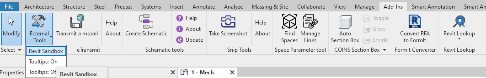

# Revit-Sandbox
A simple sandbox project to start with Revit API

## Requirements
* Microsoft Visual Studio
* Autodesk Revit 2021

## Development
All project dependencies (including `Revit API`) is managed using the Nuget package manager, just restore the Nuget packages and rebuild the project. 

You can start with a sample command function located on `Commands\SampleCommand.cs`. This command is called automatically by Revit whenever a user selects the given command from the `External Tools` Menu.



## Add-in Registration
Revit API applications are registered with Revit via a .addin manifest file. Manifest files are read automatically by Revit when they are placed in one of two locations on a user's system:

In a non-user-specific location in "application data":
```
%programdata%\Autodesk\Revit\Addins\2023\
```
In a user-specific location in "application data":
```
%appdata%\Autodesk\Revit\Addins\2023\
```
All files named .addin in these locations will be read and processed by Revit during startup. All of the files in both the user-specific location and the all users location are considered together and loaded in alphabetical order. If an all users manifest file shares the same name with a user-specific manifest file, the all users manifest file is ignored. Within each manifest file, the external commands and external applications are loaded in the order in which they are listed.

`Revit-Sandbox.addin` is a basic manifest file adding one ExternalCommand

